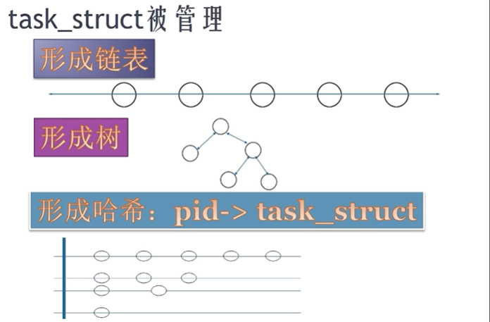
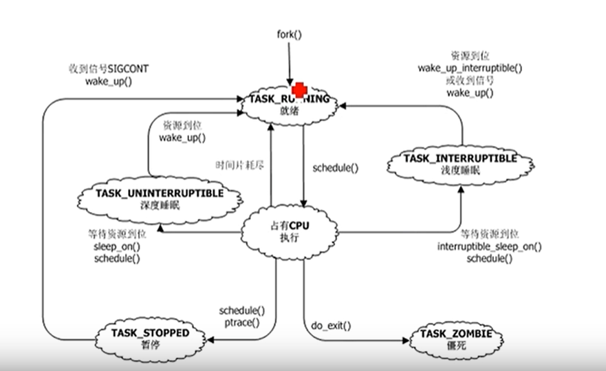
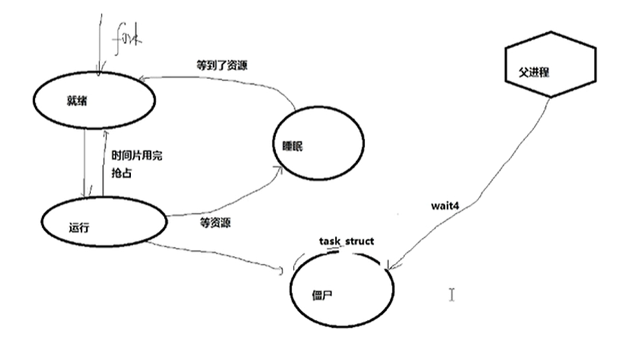
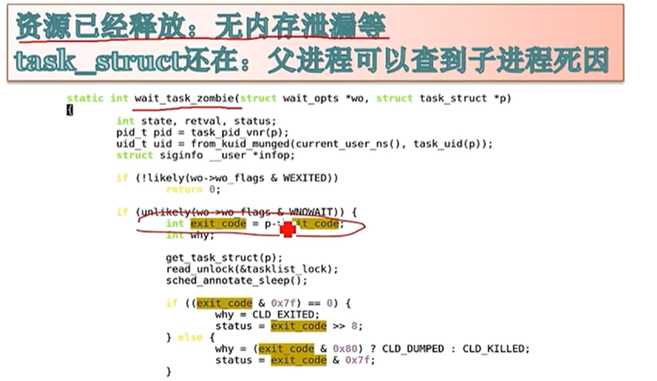

- [1. 什么是进程](#1-%e4%bb%80%e4%b9%88%e6%98%af%e8%bf%9b%e7%a8%8b)
- [2. 进程的生命周期](#2-%e8%bf%9b%e7%a8%8b%e7%9a%84%e7%94%9f%e5%91%bd%e5%91%a8%e6%9c%9f)
- [3. 僵尸进程](#3-%e5%83%b5%e5%b0%b8%e8%bf%9b%e7%a8%8b)
- [4. fork](#4-fork)
- [5. 停止态](#5-%e5%81%9c%e6%ad%a2%e6%80%81)
- [6. 深度睡眠和浅度睡眠](#6-%e6%b7%b1%e5%ba%a6%e7%9d%a1%e7%9c%a0%e5%92%8c%e6%b5%85%e5%ba%a6%e7%9d%a1%e7%9c%a0)


### 1. 什么是进程
进程是一个资源分配的单位。
+ 进程控制块`PCB`
```c
 task_struct
 {
     pid
     ...
     *mm
     *fs
     *files
     *signal
 }
```
`task_struct` 结构体用来描述进程资源 。

+ `task_struct`被管理
  进程只有一种，linux中有3个数据结构从多个不同的侧面来描述它。
  遍历所有进程，用链表。
  想知道进程的树结构，用树。
  想用`pid`快速检索进程，用哈希。
  中心思想：以空间换时间。
  <br/>
  
  <br/>

### 2. 进程的生命周期
<br/>

<br/>

### 3. 僵尸进程
<br/>

<br/>

<br/>

<br/>

+ 僵尸进程的存在是为了父进程能够通过`waitpid`获取子进程死掉的原因。
+ 僵尸进程是进程已经死掉，但父进程还没有来得及去wait它。
+ 僵尸进程资源已经释放，不会存在内存泄露的问题。
<br/>

*编程示例*
+ 使用`waitpid`来获取子进程死掉原因。
  ```c
  #include <stdio.h>
  #include <sys/wait.h>
  #include <stdlib.h>
  #include <unistd.h>

  int main(void)
  {
      pid_t pid, wait_pid;
      int status;

      pid = fork();
      if(pid == -1)
      {
          perror("cannot creat new process\n");
          exit(1);
      }
      else if(pid == 0)
      {
          printf("child process id: %ld\n", (long)getpid());
          pause();
          _exit(0);
      }
      else
      {
          do{
              wait_pid = waitpid(pid, &status, WUNTRACED | WCONTINUED);
              if(wait_pid == -1)
              {
                  perror("cannot using waitpid function\n");
                  exit(1);
              }

              if(WIFEXITED(status))
              {
                  printf("child process exites, status = %d\n", WEXITSTATUS(status));
              }

              if(WIFSIGNALED(status))
              {
                  printf("child process is killed by signal %d\n", WTERMSIG(status));
              }

              if(WIFSTOPPED(status))
              {
                  printf("child process is stopped by signal %d\n", WSTOPSIG(status));
              }

              if(WIFCONTINUED(status))
              {
                  printf("child process resume running...\n");
              }
          }while(!WIFEXITED(status) && !WIFSIGNALED(status));

          exit(0);
      }
  }
  ```
+ 运行结果：
  ```sh
  root@book-virtual-machine:/mnt/hgfs/windows/study-notes/linux/宋宝华/linux 进程线程和调度# ./a.out 
  child process id: 44470
  ```
+ 我们通过信号2来杀死子进程：
  ```sh
  root@book-virtual-machine:/home/book# kill -2 44470
  ```
+ 捕捉到杀死子进程的信号：
  ```sh
  child process id: 44470
  child process is killed by signal 2
  ```

+ <font color=red>只有杀死父进程，才可以彻底清理僵尸进程</font>

### 4. fork
+ 下面代码打印几个`hello`?
  ```c
  main()
  {
    fork();
    printf("hello\n");
    fork();
    printf("hello\n);
    while(1);
  }
  ```
  运行结果：
  ```sh
  root@book-virtual-machine:/mnt/hgfs/windows/study-notes/linux/宋宝华/linux 进程线程和调度# ./a.out 
  hello
  hello
  hello
  hello
  hello
  hello
  ```
 + 第一个`fork`分裂成2个进程，打印两个`hello`，第二个`fork`再将第一次的两个进程分裂成4个进程，打印4个`hello`，所以总共打印6个`hello`。
  

### 5. 停止态
+ `ctrl+z` 暂停
+ `fg`/`bg` 继续
+ `cpulimit` 可以用来限制一个进程的利用率。原理，将进程一会儿停止一会儿继续。

*示例*
  
  **将`pid`为44646的进程`cpu`利用率限制在20%**
  
  + `cpulimit -l 20 -p 44646`


### 6. 深度睡眠和浅度睡眠
+ 深度睡眠：必须要等到我的资源来才会醒。（不响应任何信号，`kill -9`都杀不掉）
+ 浅度睡眠：资源和信号都可以唤醒。


  


