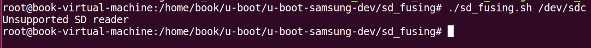
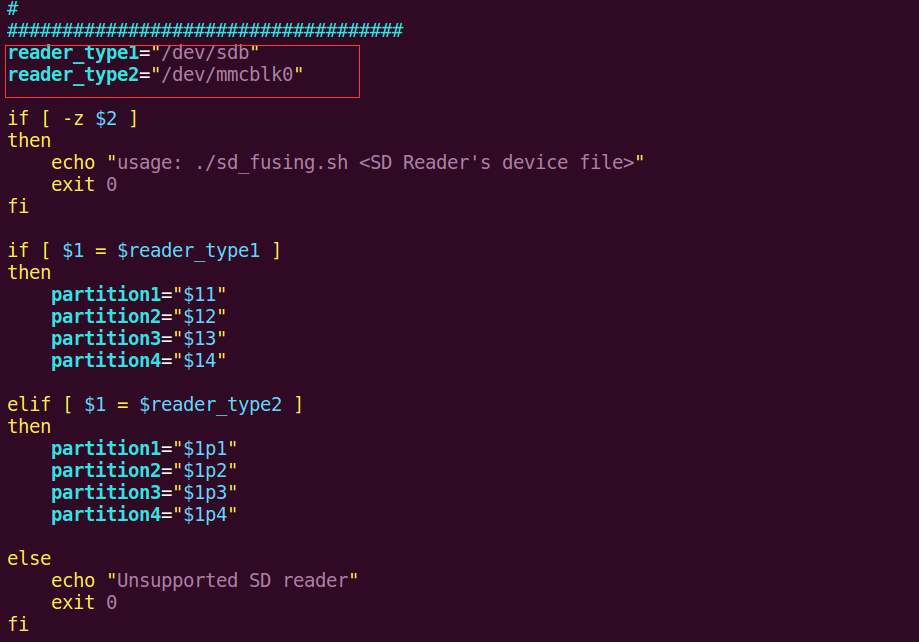
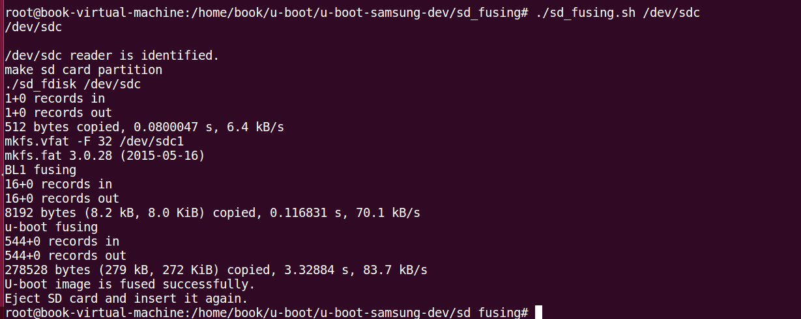
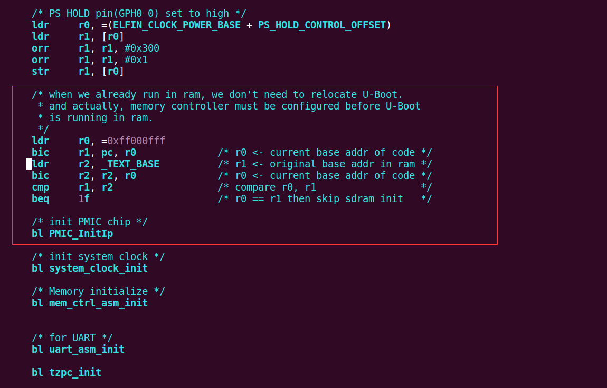
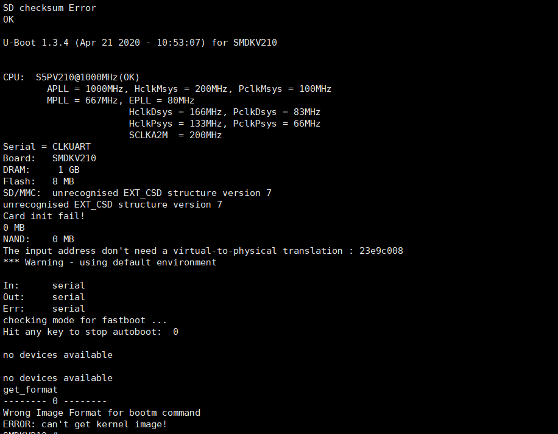
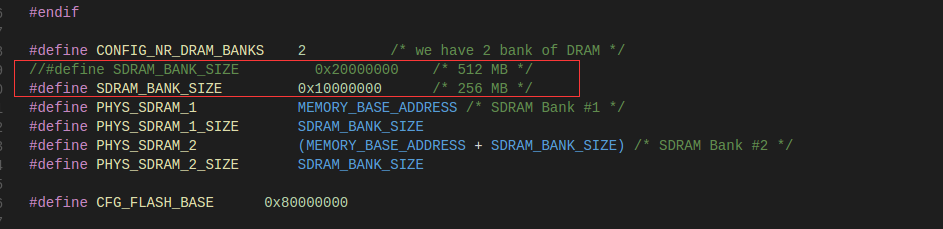
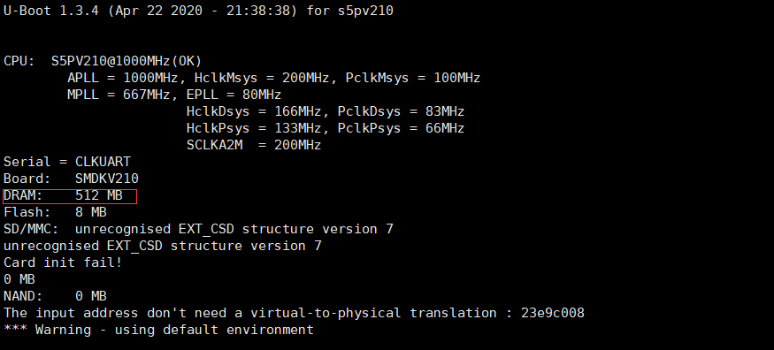
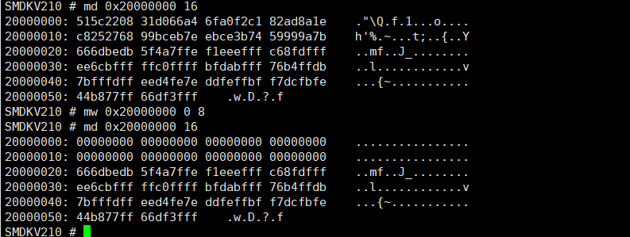

- [三星官方uboot移植](#%e4%b8%89%e6%98%9f%e5%ae%98%e6%96%b9uboot%e7%a7%bb%e6%a4%8d)
  - [1.移植初体验](#1%e7%a7%bb%e6%a4%8d%e5%88%9d%e4%bd%93%e9%aa%8c)
  - [2. DDR配置信息的更改](#2-ddr%e9%85%8d%e7%bd%ae%e4%bf%a1%e6%81%af%e7%9a%84%e6%9b%b4%e6%94%b9)


## 三星官方uboot移植
### 1.移植初体验
+ 检查`Makefile`中交叉编译工具链是否正确
  ```sh
   143 ifeq ($(ARCH),arm)
   144 #CROSS_COMPILE = arm-linux-
   145 #CROSS_COMPILE = /usr/local/arm/4.4.1-eabi-cortex-a8/usr/bin/arm-linux-
   146 #CROSS_COMPILE = /usr/local/arm/4.2.2-eabi/usr/bin/arm-linux-
   147 CROSS_COMPILE = /usr/local/arm/arm-2009q3/bin/arm-none-linux-gnueabi-
   148 endif
  ```


+ 在`include/configs`文件夹中选择与自己开发板最接近的配置文件，我们这里选择`smdkv210single_config.h`。
+ 配置
  ```sh
  root@book-virtual-machine:/home/book/u-boot/u-boot-samsung-dev# make smdkv210single_config
  Configuring for smdkv210single board...
  ```
+ 编译：`make`
+ 烧录
  + uboot中提供了sd卡烧写工具，在`sd_fusing`目录中。
  + 插入`sd`卡到电脑，使用`fdisk -l`命令查看`sd`卡设备信息
    ```sh
    Disk /dev/sdc: 7.6 GiB, 8179941376 bytes, 15976448 sectors
    Units: sectors of 1 * 512 = 512 bytes
    Sector size (logical/physical): 512 bytes / 512 bytes
    I/O size (minimum/optimal): 512 bytes / 512 bytes
    Disklabel type: dos
    Disk identifier: 0x00000000
    ```
   + 使用`sd_fusing.sh`脚本进行烧写：
    
    提示不支持的sd读卡器，查看`sd_fusing.sh`排查报错原因：
    
     >如果设备名不为`/dev/sdb`或者`/dev/mmcblk0`，即提示`"Unsupported SD reader"`，修改`/dev/sdb`为当前虚拟机中识别到的设备名`dev/sdc`。
   + 重新烧写：
     
   + 由于`s5pv210`芯片的`SD0`和`SD2`启动的拨码开关完全相同，默认`CPU`会首先从`SD0`启动，如果`SD0`没有数据，才会从`SD2`启动。而`x210`开发板`SD0`接了`emmc`，如果`emmc`中有`bootloader`，上电后会自动引导`emmc`中的`bootloader`，这时，如果我们需要从`SD2`启动，就需要破坏掉`emmc`中的`bootloader`。
   执行如下命令：
   `busybox dd if=/dev/zero of=/dev/mmcblk0 bs=512 seek=1 count=1 conv=sync` 
   为了确保执行数据有效，再执行`sync`同步一下，即可破坏掉前一个块的数据。

   + 将`sd`卡插入开发板中，启动电源：
     ```sh
     SD checksum Error
     ```
     `uboot`没有打印信息，电源灯常亮。
    *分析原因*：<font color=red>问题可能出在串口初始化和电源锁定之间。</font>
    查看`/board/samsung/smdkc110/lowlevel_init.S`代码
    
    发现在电源锁定和串口初始化之间有电源管理芯片的初始化，因为我们开发板上没有电源管理芯片，所以可能卡在电源管理芯片初始化这里，下面我们将`bl PMIC_InitIp`屏蔽掉，再次烧入`SD`卡中启动开发板：
    
     >可以看到`uboot`有打印了，可以跑起来了
     >但是打印的内存信息不对

### 2. DDR配置信息的更改
  + 开发板在`bank0`上接了256MB的`DDR`，地址为`0x20000000`到`0x2fffffff`, `bank1`中接入了256MB内存，地址为`0x40000000`到`0x4fffffff`。
  + 在`smdkv210single_config.h`中修改DDR大小
    
    重新烧写sd卡中启动开发板：
    
    读写DDR测试：
    
    发现读写正常，说明DDR初始化成功。

    

  

     

     